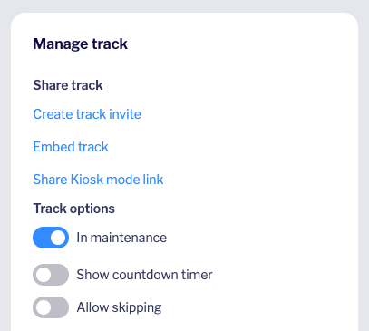

# Contributing

For general contribution and community guidelines, please see the [community repo](https://github.com/cyberark/community).

## Table of Contents

- [Prerequisites](#prerequisites)
- [Development](#development)
- [Testing](#testing)
- [Releases](#releases)
- [Updating Jenkins plugins](#updating-jenkins-plugins)

## Prerequisites

The Instruqt CLI is required in order to create, update, and test tracks.
You can install it by following the instructions on the [Instruqt website](https://docs.instruqt.com/reference/software-development-kit-sdk).

A link to the Instruqt documentation can be found [here](https://docs.instruqt.com/).

**Note:** If you encounter an error when running the `instruqt` command, you may need to run `instruqt update` to update the CLI.

## Development

Before publishing changes to a track, you should put the track into maintenance mode. This option can be found under "Track options"
on the Instruqt dashboard.

After pushing your changes, you should test the track and then take the track out of maintenance mode.

## Testing

The Instruqt tracks can be tested using the Instruqt CLI. You must have an Instruqt account with access to the CyberArk organization.

To test a track, follow the following steps:

1. Clone the repo

2. Navigate to the track you want to test

    - For example, `cd tracks/conjur.org/secure-ci-cd-pipelines`

3. Run `instruqt track validate` to validate the format of the track, or `instruqt track test` to run a
    full test of the track with it's lifecycle scripts.

## Releases

After a track has been tested and is ready to be released, follow the following steps:

1. Navigate to the track you want to release

    - For example, `cd tracks/conjur.org/secure-ci-cd-pipelines`

2. Run `instruqt track push`

## Updating Jenkins plugins

The Securing CI/CD Pipelines tutorial uses a pre-configured Jenkins container
which has a number of plugins installed. We need to periodically update those
plugins. Here's how to do it:

- From env/conjur-jenkins, run
  `docker run -p 8081:8080 -p 50000:50000 -v $(pwd)/jenkins_home:/var/jenkins_home jenkins/jenkins:lts`
- This might take a few minutes to run. When the command prompt says "Jenkins is fully up and running",
  open a browser and navigate to https://localhost:8081. You should get a Jenkins login prompt.
- The credentials are found in this repo in tracks/conjur.org/secure-ci-cd-pipelines/01-jenkins-login/assignment.md
- Log into Jenkins. Click the "Manage Jenkins" link in the left sidebar, then the "Manage Plugins" link
  in the lower right corner of the page.
- Jenkins should default to the Updates page. Update all the plugins.
- Jenkins will want to restart once it's downloaded everything. It'll probably kill your
  Docker command.
- Check there are no more updates available.
- Commit your large number of changed files, and follow the normal PR process.
- Merging the PR to master will push the changes to the live tutorial automatically, since the environment is
  pulled [dynamically](tracks/conjur.org/secure-ci-cd-pipelines/track_scripts/setup-jenkins-demo) when the track is run.

## Contributing workflow

1. [Fork the project](https://help.github.com/en/github/getting-started-with-github/fork-a-repo)
2. [Clone your fork](https://help.github.com/en/github/creating-cloning-and-archiving-repositories/cloning-a-repository)
3. Make local changes to your fork by editing files
3. [Commit your changes](https://help.github.com/en/github/managing-files-in-a-repository/adding-a-file-to-a-repository-using-the-command-line)
4. [Push your local changes to the remote server](https://help.github.com/en/github/using-git/pushing-commits-to-a-remote-repository)
5. [Create new Pull Request](https://help.github.com/en/github/collaborating-with-issues-and-pull-requests/creating-a-pull-request-from-a-fork)

From here your pull request will be reviewed and once you've responded to all
feedback it will be merged into the project. Congratulations, you're a contributor!
