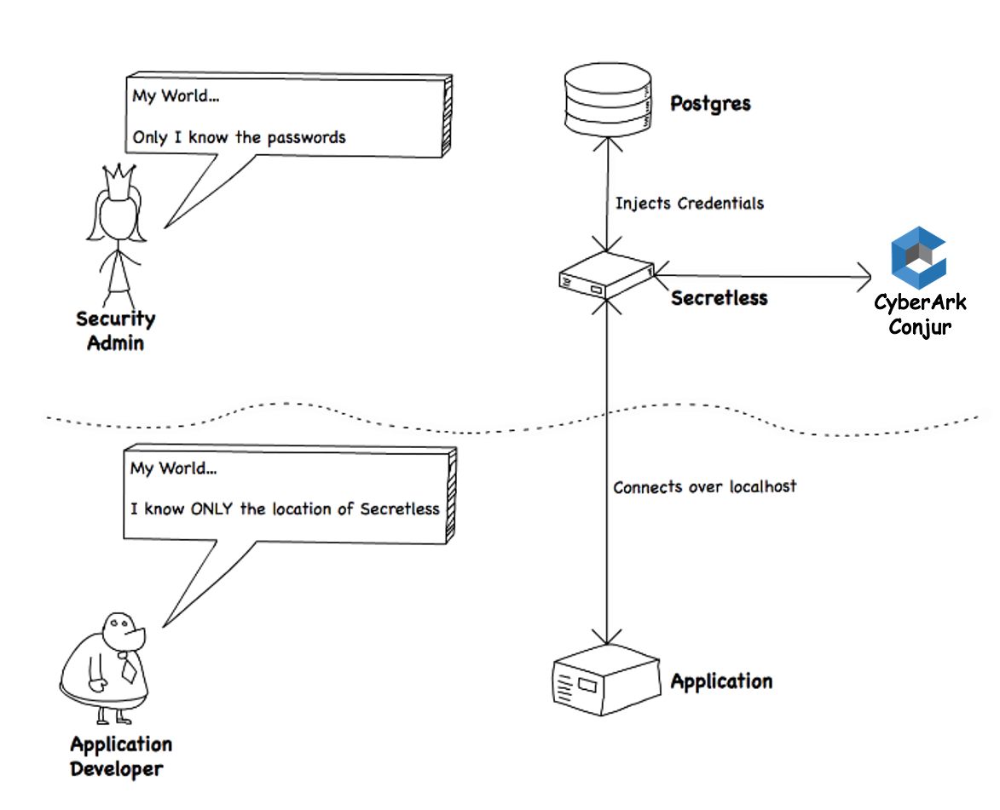

Applications and application developers should be **incapable of leaking secrets**.

To achieve that goal, you’ll play two roles in this tutorial:

1. A **Security Admin** who handles secrets, and has sole access to those secrets
2. An **Application Developer** with no access to secrets.

The situation looks like this:

Specifically, we will:

**As the security admin:**

1. Setup Conjur in Kubernetes
2. Prepare Conjur Client
3. Enable Authenticator
4. Enrolling App
5. Config Secretless Broker Sidecar

**As the application developer:**

* Deploy the application and the Secretless sidecar

**Prerequisites**

To run through this tutorial, all you need is this course!

Let's get started!

